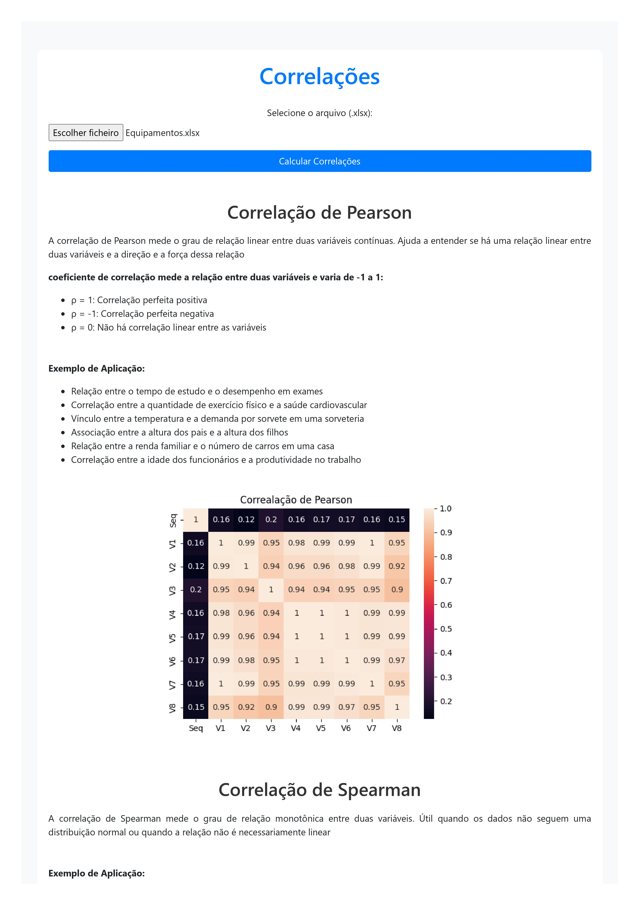

<div align="center">
  
# Software de Análises de Dados
</div>
Software elaborado para os desafios do curso de matemática e I.A. da - I2A2

- https://www.i2a2.academy/

<br><br>
Projeto: OPEN THOT Brain
- ✅ Transformando dados em resultados. O poder em suas mãos
- ✅ Aprenda com o passado e o presente, preveja tendências e comportamentos futuros
- ✅ Descubra oportunidades ocultas, identifique padrões emergentes e tome decisões informadas com confiança
- ✅ Essa solução capacita você a alcançar novos patamares de sucesso e excelência
- ✅ Comece a utilizar agora mesmo [clique aqui](http://thotiacorp.com.br:5010/) !!!
<br><br><br><br>

## Sumário  
- [Software de Análises de Dados](#software-de-análises-de-dados)
  - [Sumário](#sumário)
    - [Qualidades do sistema](#qualidades-do-sistema)
    - [Imagens do sistema](#imagens-do-sistema)
    - [Lógica do sistema de front-end](#lógica-do-sistema-de-front-end)
    - [Lógica do sistema de back-end](#lógica-do-sistema-de-back-end)
    - [Recursos do sistema](#recursos-do-sistema)
    - [Dowload do sistema](#dowload-do-sistema)
    - [Iniciar sistema windowns](#iniciar-sistema-windowns)
      - [Ambiente virtual](#ambiente-virtual)
      - [Ambiente convencional](#ambiente-convencional)
        - [Dependências](#dependências)

<br><br><br><br>

### Qualidades do sistema
<hr>

- Sistema webdev com funções recursivas dinâmicas
- Sistema utiliza ferramentas de ultima geração
- Sistema dispensa conhecimento em programação para uso
- Sistema com UI/UX interface de usuário intuitiva
- Sistema preparado pra interpretar as tarefas do curso e qualquer outra com similaridade
- Sistema com instruções AAA de ponta a ponta
- Sistema desenvolvido pela comunidade pensando em auxiliar os anaslistas de dados
<br><br><br><br>

### Imagens do sistema
<hr>
<div align="center">


https://www.figma.com/community/file/1344883461205069126
</div>
<br><br><br><br>

### Lógica do sistema de front-end
<hr>
Escala de eventos 
<br><br><br><br>

### Lógica do sistema de back-end
<hr>
<div align="center">


https://miro.com/app/board/uXjVNn0Fy84=/?share_link_id=204593179378
</div>
<br><br><br><br>

### Recursos do sistema
<hr>

- ✅ Correlações de Pearson
- ✅ Correlações de Spearman
<div align="center">



</div>
<br><br><br><br>


### Dowload do sistema
<hr>

Você pode clonar esse projeto aqui pelo github como zip ou como forma de clone para desenvolvedores
- https://github.com/THOTIACORP/I2A2-Challanges-Python.git


### Iniciar sistema windowns 
<hr>

- Clique duas vezes no aquivo
start.bat


#### Ambiente virtual


1. **Construa a imagem Docker**: No mesmo diretório do Dockerfile, execute o comando:

```bash
docker build -t versao_um .
```

Isso criará uma imagem Docker com o nome especificado

3. **Execute o contêiner**: Depois de construir a imagem, você pode executar o contêiner com o comando:

```bash
docker run -p 5010:5010 versao_um
```

Isso iniciará o contêiner em segundo plano.
Lembre-se de substituir "versao_um" pelo nome que você deseja dar à sua imagem Docker.


#### Ambiente convencional


##### Dependências
<hr>

Requerimentos externo do software 
- Faça download dos coomponentes abaixo 
- Instale o sistemas
- Crie conta e conecte-se as contas respectivas
 <br><br>

IDE - Ambiente de Desenvolvimento Integrado - programa para abrir a pasta do software e te auxiliar a codar
- https://code.visualstudio.com/download [ Não é necessário conta ]

Controle de versionamento:
- https://git-scm.com/downloads [ Não é necessário conta ]
- https://desktop.github.com/    [ Abrir conta ]

<br><br>
<br><br>

Requerimentos externo do software 
- Faça download dos coomponentes abaixo 
- Instale o sistemas

- Python3.12.2

Execute o seguinte comando no terminal 

```bash
pip 
```
